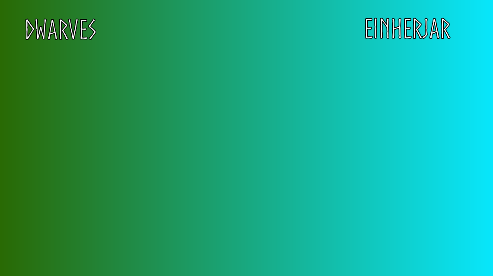

## Game Plan

### Scenes

**Login Screen**
- Username field at the top with options to either **Join Game** or **Create Game**.

**Selection Screen**
- Players can select their race and units here. Example units include Miner, Heavy, Light, etc.

**Game Scene**
- A top-down view of a mirrored arena with out-of-bounds areas and a central area with randomized loot.

### Units

The **Unit** class encompasses all entities in the game, including buildings, troops, resources, etc. Each unit starts in black and white for easy automatic recoloring based on race.

---

**Races** offer unique advantages and disadvantages. Starting races will be the **Dwarves** and the **Einherjar**. 

- **Dwarves** are master craftsmen and miners from the underground realms of Norse mythology. They excel at smithing and crafting sturdy armor and weapons. Their color palette includes earthy tones like browns and greens. They are able to craft better equipment at the cost of extra resources.

- **Einherjar** are chosen warriors who dwell in Valhalla, led by Odin. They possess enhanced combat skills and resilience, embodying the Norse warrior spirit. Their armor and weapons have a distinct mystical quality with hues of silver and blue. These spirit warriors lack speed but gain in health.

- **Future Races** include the Jotnar, powerfull giants from the realm of Jotunheim, the Elves, creatures that deal with magic that dwell from Alfhiem.

---

**Structures** are placeable by the character and range from the **Main Base** to simple **Miners** or **Barricades**.

---

**Terrain** refers to any terrain objects such as **Wood**, **Stone**, or **Essence**.

- **Essence** will be used to create new troops.
- **Wood and Stone** will be used to make structures like **Barricades** and **Defense Towers**.
